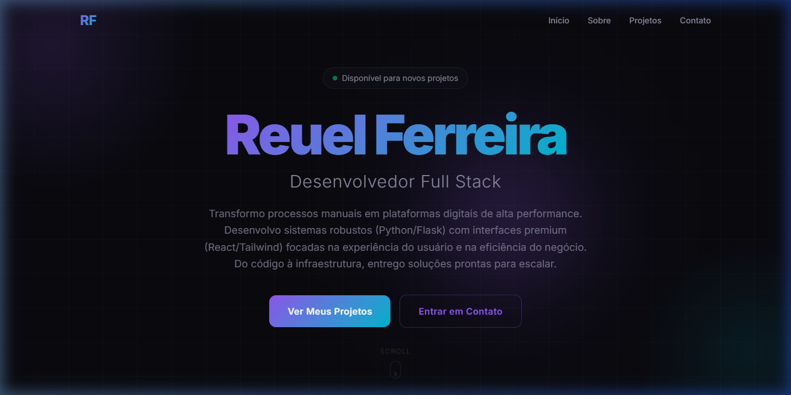
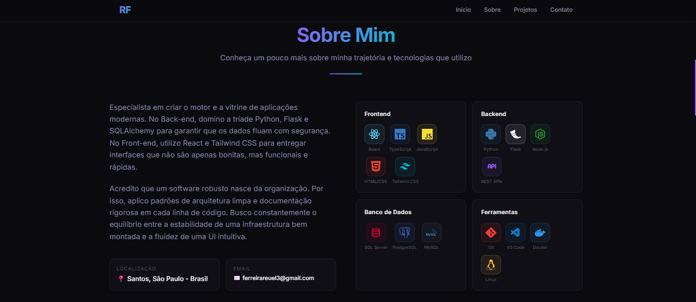
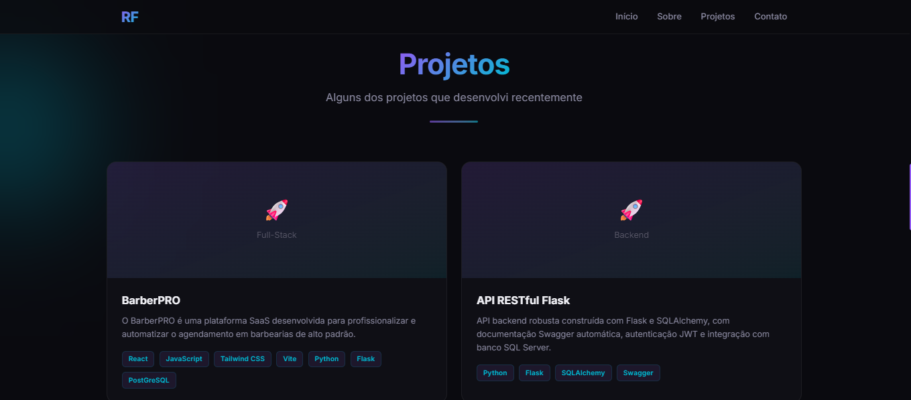
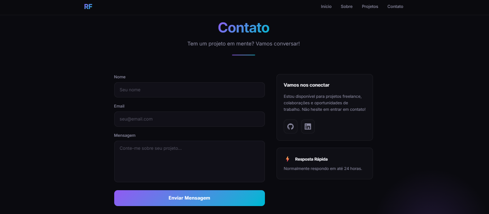

<div align="center">

# 🚀 Portfolio — Reuel Ferreira

**Desenvolvedor Full Stack**

Portfolio interativo construído com React, TypeScript e Tailwind CSS, apresentando design moderno com tema escuro, animações suaves e responsividade completa.

[](https://react.dev/)
[](https://www.typescriptlang.org/)
[](https://tailwindcss.com/)
[](https://vite.dev/)

[🔗 Ver Online](https://portfoliodev-reuel-ferreira.vercel.app/) · [📂 Repositório](https://github.com/reuel02/portfolio-reuel-ferreira)

</div>

---

## 📸 Preview

<div align="center">

| Hero | Sobre Mim |
|------|-----------|
|  |  |

| Projetos | Contato |
|----------|---------|
|  |  |

</div>

---

## ✨ Features

- 🌙 **Dark Theme Premium** — Paleta de cores escura com gradientes violet → cyan
- 💎 **Glassmorphism** — Cards com backdrop-blur e bordas semitransparentes
- 🎯 **Ícones SVG Reais** — Logos oficiais das tecnologias via `react-icons`
- 📱 **Responsivo** — Layout adaptável para mobile, tablet e desktop
- ⚡ **Animações Suaves** — Float, fade-in, slide-up, glow-pulse no hover
- 🔤 **Tipografia Inter** — Fonte moderna do Google Fonts
- 📨 **Formulário de Contato** — Campos estilizados com validação
- 🧩 **Componentizado** — Arquitetura modular e reutilizável

---

## 🛠️ Tech Stack

| Camada | Tecnologias |
|--------|-------------|
| **Frontend** | React 19, TypeScript, Tailwind CSS v4 |
| **Build** | Vite 8 |
| **Ícones** | react-icons (Simple Icons, Tabler, VS Code) |
| **Tipografia** | Google Fonts (Inter) |
| **Linting** | ESLint |

---

## 📁 Estrutura do Projeto

```
src/
├── components/          # Componentes React
│   ├── Navbar.tsx       # Navegação fixa com glassmorphism
│   ├── Hero.tsx         # Seção principal com CTAs
│   ├── About.tsx        # Sobre mim + grid de skills
│   ├── Projects.tsx     # Grid de projetos
│   ├── ProjectCard.tsx  # Card individual de projeto
│   ├── Contact.tsx      # Formulário de contato
│   ├── Footer.tsx       # Rodapé
│   └── SectionTitle.tsx # Título reutilizável de seção
├── data/
│   └── portfolio.ts     # Dados do portfolio (projetos, skills, info)
├── types/
│   └── index.ts         # Interfaces TypeScript
├── pages/
│   └── Landing.tsx      # Página principal
├── App.tsx              # Componente root
├── App.css              # Utility classes customizadas
├── index.css            # Design system + animações
└── main.tsx             # Entry point
```

---

## 🚀 Como Rodar Localmente

### Pré-requisitos

- [Node.js](https://nodejs.org/) (v18+)
- [npm](https://www.npmjs.com/) ou [yarn](https://yarnpkg.com/)

### Instalação

```bash
# Clone o repositório
git clone https://github.com/reuel02/portfolio-reuel-ferreira.git

# Acesse a pasta
cd portfolio-reuel-ferreira

# Instale as dependências
npm install

# Inicie o servidor de desenvolvimento
npm run dev
```

O projeto estará disponível em `http://localhost:5173/`

### Build para Produção

```bash
npm run build
```

Os arquivos de produção serão gerados na pasta `dist/`.

---

## 🎨 Personalização

### Dados Pessoais

Edite o arquivo `src/data/portfolio.ts` para atualizar:

- **Informações pessoais** — nome, título, descrição, email, localização
- **Projetos** — título, descrição, tech stack, links
- **Skills** — categorias e tecnologias
- **Links sociais** — GitHub, LinkedIn

### Design System

As cores, fontes e animações estão configuradas em:

- `src/index.css` — Variáveis do tema (`@theme`), keyframes, estilos globais
- `src/App.css` — Classes utilitárias (glassmorphism, botões, gradientes)

---

## 📄 Licença

Este projeto é de uso pessoal. Sinta-se livre para usar como referência.

---

<div align="center">

Feito por **[Reuel Ferreira](https://github.com/reuel02)**

[](https://github.com/reuel02)
[](https://www.linkedin.com/in/reuel-ferreira/)

</div>
